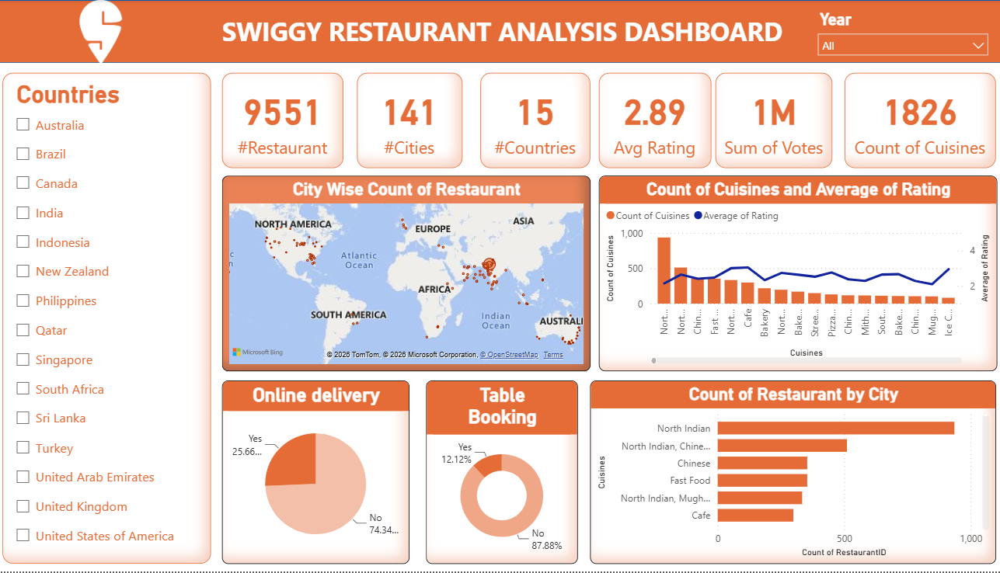

# 🍽️ Swiggy Restaurant Analysis Dashboard

  

<h2 align="center">📊 Power BI | Restaurant Analytics | Data Visualization</h2>

  An interactive Power BI dashboard designed to analyze restaurant distribution,
  cuisines, ratings, customer votes, online delivery, and table booking trends.

---

## 🎯 Project Overview

The **Swiggy Restaurant Analysis Dashboard** transforms restaurant data into
interactive business insights using Microsoft Power BI.

The dashboard helps analyze:

* 🌍 Country-wise restaurant distribution
* 📍 City-wise restaurant count
* 🍴 Cuisine popularity
* ⭐ Average restaurant ratings
* 🗳️ Customer votes
* 🚚 Online delivery availability
* 🪑 Table booking availability
* 📊 Restaurant and cuisine trends

---

## 📌 Key Performance Indicators

| KPI                   |     Value |
| --------------------- | --------: |
| 🍽️ Total Restaurants | **9,551** |
| 🏙️ Cities Covered    |   **141** |
| 🌍 Countries Covered  |    **15** |
| ⭐ Average Rating      |  **2.89** |
| 🗳️ Total Votes       |   **1M+** |
| 🍴 Cuisines           | **1,826** |

---

## 🔍 Dashboard Analysis

### 🌍 Country Analysis

The dashboard provides a country-level view of restaurant distribution,
allowing users to understand the geographical presence of restaurants.

### 🏙️ City-wise Restaurant Analysis

Identifies cities with the highest concentration of restaurants and provides
a geographical view of restaurant locations.

### 🍴 Cuisine Analysis

Analyzes the number of restaurants across different cuisines and compares
cuisine availability with average ratings.

### ⭐ Rating Analysis

Shows average ratings across cuisines to identify cuisines receiving
relatively higher or lower customer ratings.

### 🚚 Online Delivery Analysis

Analyzes the availability of online food delivery services across restaurants.

### 🪑 Table Booking Analysis

Shows the proportion of restaurants offering table-booking facilities.

---

## 💡 Key Insights

🔹 The dataset contains **9,551 restaurants** across **141 cities and
15 countries**.

🔹 The average restaurant rating in the dataset is approximately **2.89**.

🔹 **North Indian** cuisine has the highest restaurant representation in the
dashboard.

🔹 Online delivery availability is significantly higher than table-booking
availability.

🔹 Restaurant distribution varies considerably across cities and countries.

🔹 Cuisine-level analysis helps identify both highly represented cuisines and
their corresponding average ratings.

---

## 🛠️ Tools & Technologies

| Tool               | Purpose                        |
| ------------------ | ------------------------------ |
| 📊 Power BI        | Dashboard & Data Visualization |
| 🔄 Power Query     | Data Cleaning & Transformation |
| 🧮 DAX             | Calculations & KPIs            |
| 📁 Microsoft Excel | Data Preparation               |
| 🗺️ Bing Maps      | Geographical Visualization     |

---

## 📈 Dashboard Features

✅ Interactive country filters
✅ Year filter
✅ KPI cards
✅ City-wise restaurant map
✅ Cuisine count and rating comparison
✅ Online delivery analysis
✅ Table booking analysis
✅ Restaurant count by city/cuisine
✅ Interactive visualizations

---

## 📂 Project Files

📄 `Swiggy_Restaurant_Analysis.pbix`
→ Power BI dashboard file

🖼️ `Swiggy_Dashboard.png.png`
→ Dashboard preview image

📘 `README.md`
→ Project documentation

---

## 🎓 Learning Outcomes

Through this project, I gained practical experience in:

* Data cleaning and transformation
* Power Query
* DAX calculations
* KPI creation
* Interactive dashboard development
* Geographical data visualization
* Restaurant and customer analytics
* Business insight generation
* Data storytelling

---

## 👨‍💻 Author

### **Dheerendra Singh Rathore**

🎓 MBA | Finance & Marketing
📊 Aspiring Financial / Data Analyst
💡 Interested in Finance, Business Analytics & Data Visualization

---

## ⭐ Support

If you find this project useful, consider giving the repository a ⭐.

  <b>Built with Power BI 📊</b>

